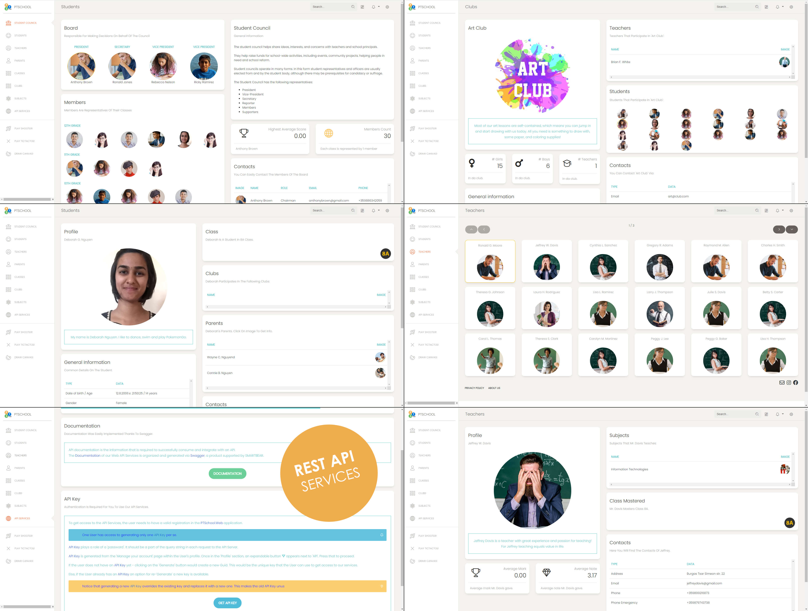
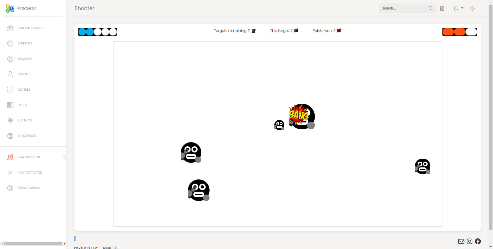
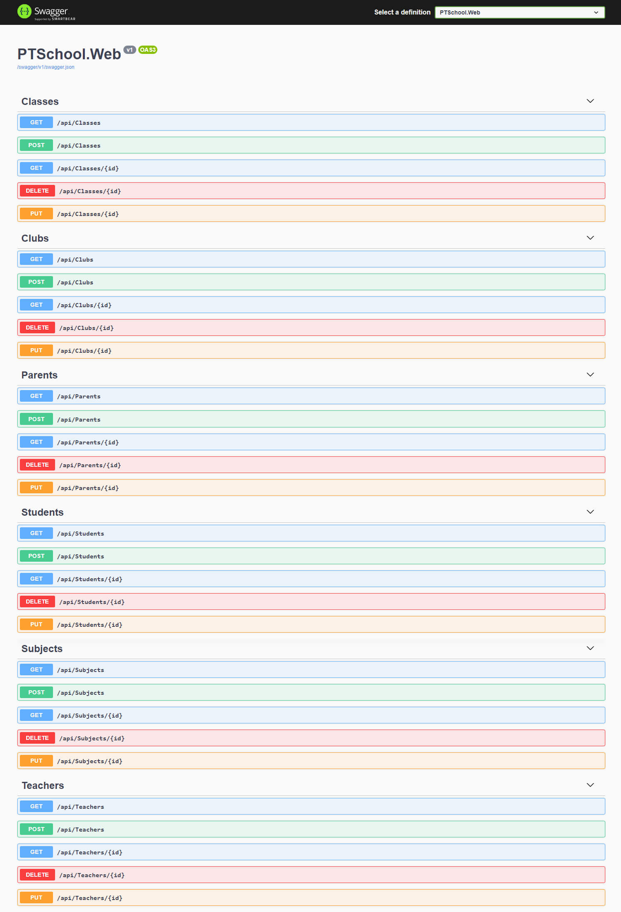

# PT_WebApp_PTSchool

## General Information

_N.B. This is a "legacy" project created for educational purposes before the start of my Telerik Academy Alpha formal education._  
\*_It is currently in a process of massive refactoring. The goal is to achieve the same quality as our final project in Telerik Academy which I created in collaboration with Iva Pavlova..._  
Link: https://gitlab.com/Iva_Pavlova/team9projectplaylistgenerator

PT_WebApp_PTSchool is an ASP.NET Core MVC Web Application that provides an online platform for different services for Parents, Teachers and Students within a school institution.

## Technologies

- Automapper
- EntityFrameworkCore.SqlServer
- EntityFrameworkCore.Tools
- Hangfire
- Serilog
- SignalR
- Swagger

## Resources

- Creative Tim (Bootstrap Template)  
  Link: https://www.creative-tim.com
- NewsApi (API)  
  Link: https://newsapi.org  
  Using Hangfire everyday at 09:00 AM we gather a collection of current news about Education from BBC News, automatically.  
  The news we got we store in our database for the day. This time optimization has great impact on user experience and performance.

## User Guide

The main functionality of the web app is to facilitate the communication between the 3 main "sides" within a School Institution:

- (P)arents
- (T)eachers
- (S)tudents

### (P)arents

- check their child's marks / notes and sign them
- receive code-red notifications for a poor mark or a note concerning inappropriate behavior

### (T)eachers

- add new marks / notes to (S)tudents
- create new Clubs

### (S)tudents

- apply for a Club
- communicate with each other (S)<>(S)
- end an email to a (T)eacher or chat directly

## Additional Functionalities

### SchoolChat!

SignalR web-socket connection provides a real-time massive **chat** that everybody can join and share!

### SchoolCanvas!

SignalR also provides a real-time **canvas** that can be used by anybody to express themselves freely.

\~If you have the urge to write an offensive statement in front of the whole school and run away - this is your chance!\~

### TicTacToeGame!

Thanks to SignalR TicTacToe lets you:

- Create one by yourself and wait for your buddy to join!
- Join a TicTacToe room already created

Play TicTacToe!

### PTShooterGame!!!

A mouse-click shooter with no page-reloading.  
No page reloading, vanilla JavaScript only.

Start with:

- Health = 3
- Gun Reload = 5
- Enemies = 12

You-shoot-them-all-or-they-shoot-you.  
As simple as that!

---

## Contents

The solution contains 4 main directories with 6 projects:

- Console
  - PTSchool.Console
- Data
  - PTSchool.Data
  - PTSchool.Data.Models
- Services
  - PTSchool.Services
  - PTSchool.Services.Models
- Web
  - PTSchool\.Web
    - Models-Views-Controllers (MVC) application
    - ApiControllers ( : ControllerBase) to serve the purposes of a RESTful API

---

## Web Application

### PTSchool\.Web > MVC

PTSchool\.Web is a .NET Core 3.1 MVC Web Application.

### PTSchool\.Web > API

The API functionality is implemented inside the .NET Core 3.1 MVC Web Application.  
All the services provided are organized inside the 'ApiControllers' directory.

A screenshot of the Operations - API Documentation by Swagger  

---

## Services Layer

### PTSchool.Services

PTSchool.Services is a .NET Standard 2.1 Class Library project.

### PTSchool.Services.Models

PTSchool.Services.Models is a .NET Standard 2.1 Class Library project.

---

## Data Layer

### PTSchool.Data

PTSchool.Data is a .NET Standard 2.1 Class Library project.

### PTSchool.Data.Models

PTSchool.Data.Models is a .NET Standard 2.1 Class Library project.

---

## Console Application

### PTSchool.Console

PTSchool.Console is a .NET Core 3.1 Console Application.  
The Main() method in Program.cs calls a series of methods that seed information in the Database of the application.  
They are called in a certain order, as entities in the database have certain relations that create dependencies between them.  
_For example, to assign a Mark or a Note to e Student you need to have a Subject, a Teacher etc._
Here is the order of the methods called in Main():

🏁  
PTSchoolDbSeeder.SeedTeachers();  
👇  
PTSchoolDbSeeder.SeedClasses();  
👇  
PTSchoolDbSeeder.SeedStudents();  
👇  
PTSchoolDbSeeder.SeedParents();  
👇  
PTSchoolDbSeeder.SeedParentsToStudentsRelation();  
👇  
PTSchoolDbSeeder.SeedSubjects();  
👇  
PTSchoolDbSeeder.SeedClubs();  
👇  
PTSchoolDbSeeder.SeedTeachersToSubjectsRelation();  
👇  
PTSchoolDbSeeder.SeedTeachersToClubsRelation();  
👇  
PTSchoolDbSeeder.SeedStudentsToClubsRelation();  
👇  
PTSchoolDbSeeder.SeedSubjectsToClasses();  
👇  
PTSchoolDbSeeder.SeedNotes();  
👇  
PTSchoolDbSeeder.SeedMarks();  
🏁

---

\~THE END\~
