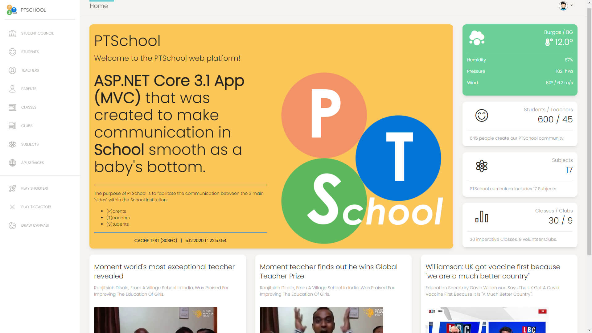
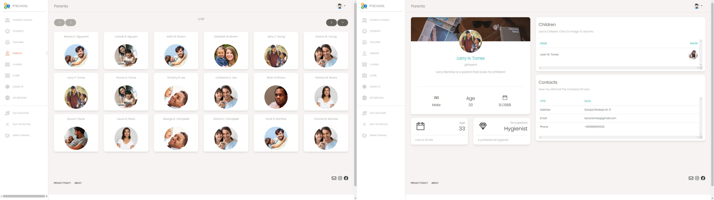
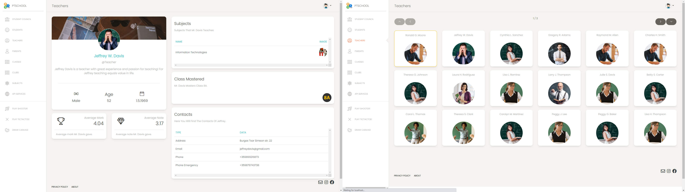
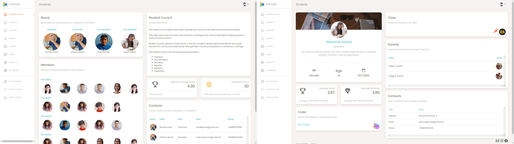
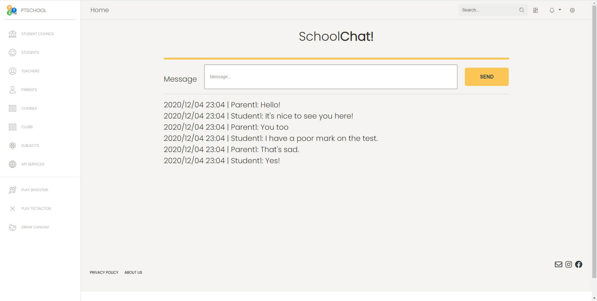
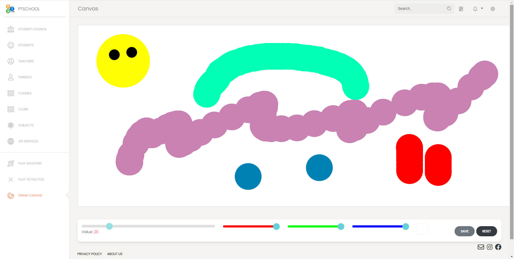
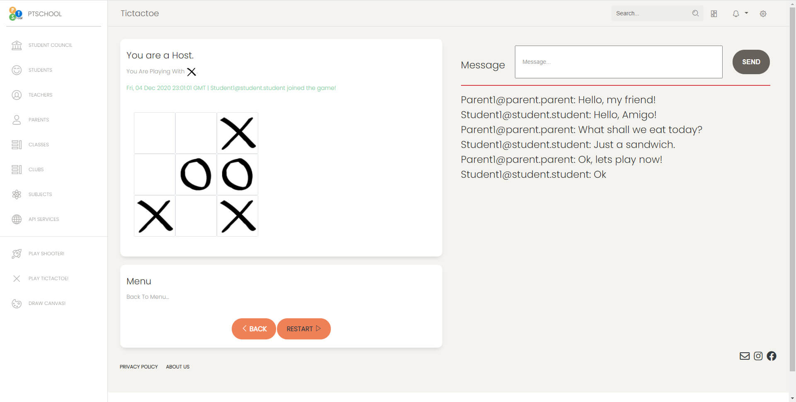

# PT_WebApp_PTSchool

## General Information

PT_WebApp_PTSchool is an ASP.NET Core MVC web application that provides an online platform for different services for Parents, Teachers and Students within a school institution.

_N.B. This is a "legacy" project created for educational purposes before the start of my Telerik Academy Alpha formal education._  
_It is currently in a process of massive refactoring. The goal is to achieve the same quality as our final project in Telerik Academy which I created in collaboration with Iva Pavlova..._  
Link: https://gitlab.com/Iva_Pavlova/team9projectplaylistgenerator

## Technologies

- Automapper
- EntityFrameworkCore.SqlServer
- EntityFrameworkCore.Tools
- ML.NET (Recommendation Task)
- Hangfire
- Serilog
- SignalR
- Swagger

## Resources

- Creative Tim (Bootstrap Template)  
  Link: https://www.creative-tim.com
- NewsApi (API)  
  Link: https://newsapi.org  
  Using Hangfire everyday at 09:00 AM we gather a collection of current news about Education from BBC News, automatically.  
  The news we get we store in our database during the day. This optimizes performance, ergo user experience.
- OpenWeatherMap (API)  
  Link: https://openweathermap.org/  
  Accurate, basic information about the weather in Burgas is provided in the top right corner of the home page, thanks to this friendly API.

## User Guide

The main functionality of the web app is to facilitate the communication between the 3 main "sides" within a School Institution:

- (P)arents
- (T)eachers
- (S)tudents

### (P)arents

- check their child's marks / notes and sign them
- receive code-red notifications for a poor mark or a note concerning inappropriate behavior

### (T)eachers

- add new marks / notes to (S)tudents
- create new Clubs

### (S)tudents

- apply for a Club
- communicate with each other (S)<>(S)
- end an email to a (T)eacher or chat directly

## Additional Functionalities

### SchoolChat!

SignalR web-socket connection provides a real-time massive **chat** that everybody can join and share!

### SchoolCanvas!

SignalR also provides a real-time **canvas** that can be used by anybody to express themselves freely.

\~If you have the urge to write an offensive statement in front of the whole school and run away - this is your chance!\~

### TicTacToeGame!

Thanks to SignalR TicTacToe lets you:

- Create one by yourself and wait for your buddy to join!
- Join a TicTacToe room already created

Play TicTacToe!

### PTShooterGame!!!

A mouse-clicking shooter.  
No page reloading, vanilla JavaScript only.

Start with:

- Health = 3 - so you can get shot by the bandits only twice
- Gun Reload = 5 - don't forget to reload with Enter key
- Enemies = 12

You-shoot-them-all-or-they-shoot-you.  
As simple as that!

---

## Contents

The solution contains 4 main directories with 6 projects:

- Web
  - PTSchool\.Web
    - Models-Views-Controllers (MVC) application
    - ApiControllers ( : ControllerBase) to serve the purposes of a RESTful API
- Services
  - PTSchool.Services
  - PTSchool.Services.Models
- Data
  - PTSchool.Data
  - PTSchool.Data.Models
- Console
  - PTSchool.Console

---

## Web Application

### PTSchool\.Web > MVC

PTSchool\.Web is a .NET Core 3.1 MVC Web Application.

### PTSchool\.Web > API

The API functionality is implemented inside the .NET Core 3.1 MVC Web Application.  
All the services provided are organized inside the 'ApiControllers' directory.

A screenshot of the Operations - API Documentation by Swagger  

---

## Services Layer

### PTSchool.Services

PTSchool.Services is a .NET Standard 2.1 Class Library project.

---

### PTSchool.Services.Models

PTSchool.Services.Models is a .NET Standard 2.1 Class Library project.

---

## Data Layer

### PTSchool.Data

PTSchool.Data is a .NET Standard 2.1 Class Library project.

The project consists of all configurations, migrations, DbContext and data settings needed for a Database to be manipulated via Entity Framework Core.

It includes:

- /Configuration/... - all configuration files defining the relations between entities and their behavior in case of delete
- /Data/Migrations/... - all migrations that keep the history of database changes
- PTSchoolDataSettings.cs - a const string "DefaultConnection"
- PTSchoolDbContext.cs

---

### PTSchool.Data.Models

PTSchool.Data.Models is a .NET Standard 2.1 Class Library project.

The project consists of all of the Data Models that are needed to manipulate the database.

It includes the following Data Models:

- /ApiNews - all data models transferring information on the 20 articles received via NewsApi from BBC and saved locally in the Database thanks to Hangfire at 07:00 daily
- /Enums - all enums that the data models use
- /Validations/StaticValidator.cs - a static class that holds all constant integers that represent MinLength, MaxLength Validations on properties - all at one place.
- Class.cs
- Club.cs
- ClubStudent.cs (many-to-many)
- ClubTeacher.cs (many-to-many)
- Mark.cs
- Note.cs
- Parent.cs
- Student.cs
- StudentParent.cs (many-to-many)
- Subject.cs
- SubjectClass.cs (many-to-many)
- SubjectTeacher.cs (many-to-many)
- Teacher.cs
- TeacherClass.cs (many-to-many)
- Tictactoe.cs

---

## Console Application

### PTSchool.Console

PTSchool.Console is a .NET Core 3.1 Console Application.  
The Main() method in Program.cs calls a series of methods that seed information in the Database of the application.  
They are called in a certain order, as entities in the database have certain relations that create dependencies between them.  
_For example, to assign a Mark / Note to a Student you need to have a Subject and a Teacher etc._

Here is the order of the methods called in Main():

🏁  
PTSchoolDbSeeder.SeedTeachers();  
👇  
PTSchoolDbSeeder.SeedClasses();  
👇  
PTSchoolDbSeeder.SeedStudents();  
👇  
PTSchoolDbSeeder.SeedParents();  
👇  
PTSchoolDbSeeder.SeedParentsToStudentsRelation();  
👇  
PTSchoolDbSeeder.SeedSubjects();  
👇  
PTSchoolDbSeeder.SeedClubs();  
👇  
PTSchoolDbSeeder.SeedTeachersToSubjectsRelation();  
👇  
PTSchoolDbSeeder.SeedTeachersToClubsRelation();  
👇  
PTSchoolDbSeeder.SeedStudentsToClubsRelation();  
👇  
PTSchoolDbSeeder.SeedSubjectsToClasses();  
👇  
PTSchoolDbSeeder.SeedNotes();  
👇  
PTSchoolDbSeeder.SeedMarks();  
🏁

---

\~THE END\~
